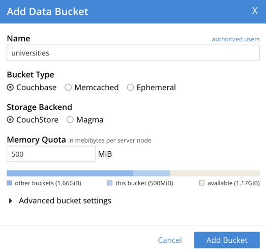
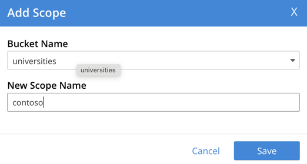
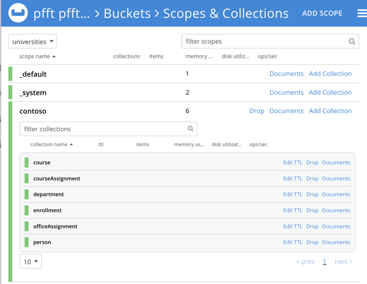

# Contoso University Sample App:

This the sample app that is included in the [Tutorial: Get started with EF Core in an ASP.NET MVC wep app](https://learn.microsoft.com/en-us/aspnet/core/data/ef-mvc/intro?view=aspnetcore-8.0) that uses Couchbase EFCore instead of Sqlite EFCore. 

## Prerequisites
* Requires [.NET 8 SDK](https://dotnet.microsoft.com/en-us/download/dotnet/8.0) to build
* Setup Couchbase Server:
  * Works best with [Couchbase Server 7.6.0](https://www.couchbase.com/downloads/?family=couchbase-server#) or better. If you chose to use an earlier Couchbase version you will manually need to add the indexes, which can be quite time consuming - OR-
  * [Couchbase Capella ](https://www.couchbase.com/downloads/?family=capella) Cloud also works and has a free-tier that makes it easy to get up and running. Refer to the [documentation](https://docs.couchbase.com/home/cloud.html) for getting up and running with Capella -OR-
  * A Couchbase [docker image](https://docs.couchbase.com/server/current/install/getting-started-docker.html) may also be used.

## Create the Couchbase Server Bucket

Couchbase Server uses Buckets in place of RDBMS database instances. For the Contoso University app, we will create a Bucket named "universities":

In Couchbase, a Scope is an example of a tenant. For the Contoso University application, we will create a Scope named "contoso":

Finally, we will create Collections for each entity in the Contoso model:

When the application loads, it will generate the documents for the model and store them in the Bucket.

## Running the Contoso University web app
Depending upon which IDE or editor you are using, you will either:
* _Run 'CouchbaseGettingStarted'_ in Rider IDE Or,
* _Debug > Start Without Debugging_ in VS Or,
* `dotnet run` in .NET CLI

