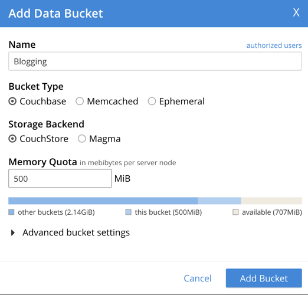
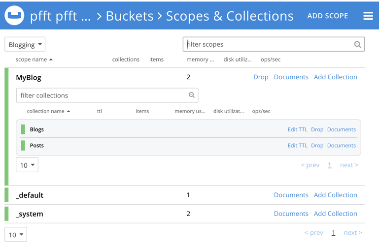

# Getting started
The following are detailed steps for getting up and running with Couchbase.EntityFrameworkCore via a Console application. The Contoso University sample application is also a great way to become familier with the provider.

> [!NOTE]
> This is a clone of the [EFGettingStarted](https://learn.microsoft.com/en-us/ef/core/get-started/overview/first-app) example in the MS Docs.

## Prerequisites
* Download and Install [.NET 8](https://dotnet.microsoft.com/en-us/download/dotnet/8.0)
* Download and install [Couchbase server 7.6.0](https://docs.couchbase.com/server/current/install/install-intro.html) or greater. You can also do this using [docker](https://docs.couchbase.com/server/current/install/getting-started-docker.html) and providing the version. Another option is to use [Couchbase Capella](https://www.couchbase.com/products/capella/), which now as a free tier.

## Create a Console application
* Create the .NET Console Application using [this tutorial](https://learn.microsoft.com/en-us/dotnet/core/tutorials/with-visual-studio-code?pivots=dotnet-8-0) or [Visual Studio](https://learn.microsoft.com/en-us/dotnet/core/tutorials/with-visual-studio?pivots=dotnet-8-0) or via the [Command Line](https://learn.microsoft.com/en-us/dotnet/core/tools/dotnet-new)
```
mkdir CouchbaseGettingStarted
cd CouchbaseGettingStarted
dotnet new console
```
* Once you have created the console application add the dependency on Couchbase.EntityFrameworkCore:
```
dotnet install Couchbase.EntityFrameworkCore --version 1.0.0-dp1
```
* In the project directory, create Model.cs with the following code
```
using Microsoft.EntityFrameworkCore;
using Couchbase;
using Couchbase.EntityFrameworkCore;
using Couchbase.Extensions.DependencyInjection;

public class BloggingContext : DbContext
{
    public DbSet<Blog> Blogs { get; set; }
    public DbSet<Post> Posts { get; set; }
    
    //The following configures the application to use a Couchbase cluster
    //on localhost with a Bucket named "universities" and a Scope named "contoso"
    protected override void OnConfiguring(DbContextOptionsBuilder options)
        => options.UseCouchbase<INamedBucketProvider>(new ClusterOptions()
                .WithCredentials("Administrator", "password")
                .WithConnectionString("couchbase://localhost"),
            couchbaseDbContextOptions =>
            {
                couchbaseDbContextOptions.Bucket = "universities";
                couchbaseDbContextOptions.Scope = "contoso";
            });
}

public class Blog
{
    public int BlogId { get; set; }
    public string Url { get; set; }

    public List<Post> Posts { get; } = new();
}

public class Post
{
    public int PostId { get; set; }
    public string Title { get; set; }
    public string Content { get; set; }

    public int BlogId { get; set; }
    public Blog Blog { get; set; }
}
```
## Create the database
Login into your Couchbase server and add the following Bucket _"Blogging"_:



Create the following Scope _"MyBlog"_:


Create the following Collections for _"Blogs"_ and _"Posts"_:



## Create, read, update & delete
* Open _Program.cs_ and replace the contents with the following code
```
using System;
using System.Linq;

using var db = new BloggingContext();

// Note: This sample requires the database to be created before running.
Console.WriteLine($"Database path: {db.DbPath}.");

// Create
Console.WriteLine("Inserting a new blog");
db.Add(new Blog { Url = "http://blogs.msdn.com/adonet" });
db.SaveChanges();

// Read
Console.WriteLine("Querying for a blog");
var blog = db.Blogs
    .OrderBy(b => b.BlogId)
    .First();

// Update
Console.WriteLine("Updating the blog and adding a post");
blog.Url = "https://devblogs.microsoft.com/dotnet";
blog.Posts.Add(
    new Post { Title = "Hello World", Content = "I wrote an app using EF Core!" });
db.SaveChanges();

// Delete
Console.WriteLine("Delete the blog");
db.Remove(blog);
db.SaveChanges();
```

## Run the app
* _Run 'CouchbaseGettingStarted'_ in Rider IDE Or,
* _Debug > Start Without Debugging_ in VS Or,
* `dotnet run` in .NET CLI
```
/source/couchbase-dotnet-ef/samples/CouchbaseGettingStarted/bin/Debug/net8.0/CouchbaseGettingStarted
Inserting a new blog
Querying for a blog
Updating the blog and adding a post
Delete the blog

Process finished with exit code 0.

```