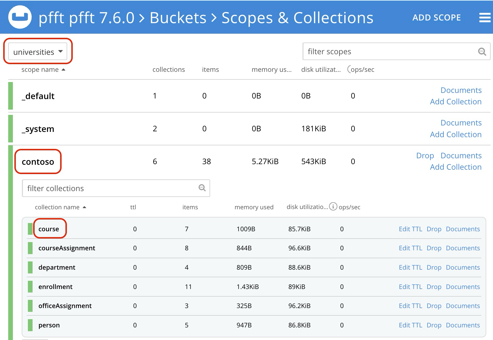
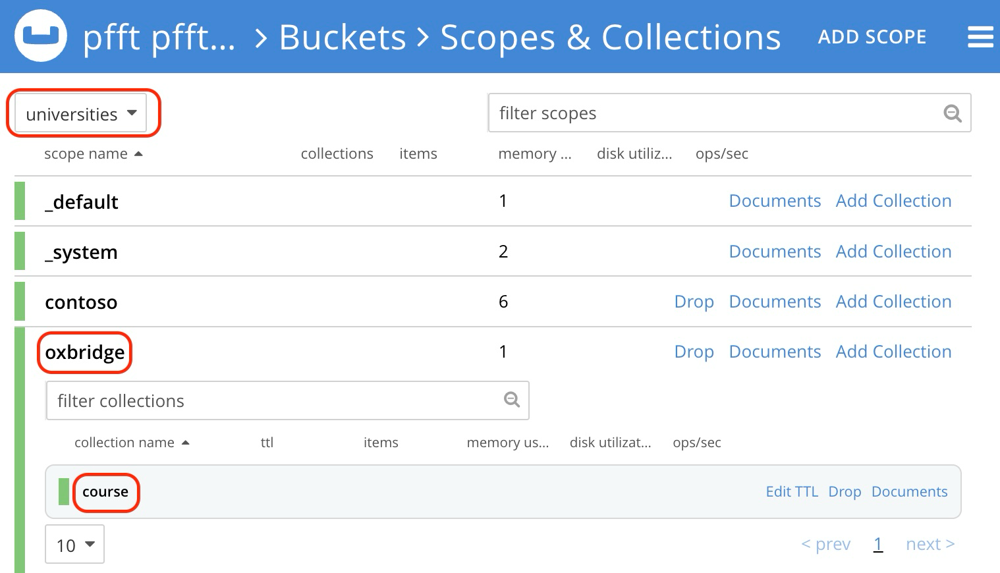

# Configuring the model with the EF Core Couchbase DB Provider

## Buckets, Scopes, Collections and Entity Types
In Couchbase DB, a Bucket is the fundamental place for storing documents. Within a Bucket, documents can be categorized hierarchically into Scopes and Collections. Scopes are a unit of tenancy, and collections are analogous to RDBMS tables. The unique combination of Bucket, Scope and Collection is referred to as a Keyspace.

When modeling for Couchbase EF Core DB Provider, we must map entities to a Keyspace. The provider allows you to do this via attributes on an entity or by using DbContext.OnModelCreated.

> [!NOTE]
> EF Core allows for default modeling where the name of the entity class will be used as the table name explicity if the class is part of a DbSet<T>. This will work for the Couchbase EF Core DB Provider as well, however, the default Scope "_default" will be used if not provided during configuration and the Collection with the same name will have to be created on the server which will match the class name as well.

Assuming we have configured a DbContext for an application such as the Contoso University Sample as follows:

```
builder.Services.AddDbContext<SchoolContext>(options=>
    options.UseCouchbase(new ClusterOptions()
    .WithCredentials("Administrator", "password")
    .WithConnectionString("couchbase://localhost"),
        couchbaseDbContextOptions =>
        {
            couchbaseDbContextOptions.Bucket = "universities";
            couchbaseDbContextOptions.Scope = "contoso";
        }));
```
                                                                                                                                                                                                                                        
If the Scope has been defined in the initial configuration of the Provider, then only the Collection name is required when modeling:

```
modelBuilder.Entity<Course>().ToCouchbaseCollection(this, "course");
```

In this case "course" is a Collection that has been created on the Couchbase Server. This will map the Course entity to the following Keyspace:

```
`universities`.`contoso`.`course`
```

In this case the Scope is "contoso" and the Collection is "course".



### Using the [CouchbaseKeyspace] attribute

The same mappings shown above with `ToCouchbaseCollection` are available as a `[CouchbaseKeyspace]`
attribute directly on the entity class, for those who prefer keeping the keyspace visible on the
model itself. It has three constructors, matching the three `ToCouchbaseCollection` overloads:

```csharp
// Collection only — inherits the DbContext's configured Bucket and Scope.
[CouchbaseKeyspace("course")]
public class Course { /* ... */ }

// Scope and collection — overrides the DbContext's Scope, keeps its Bucket.
[CouchbaseKeyspace("oxbridge", "course")]
public class Course { /* ... */ }

// Bucket, scope, and collection — overrides everything (used for entities that live in a
// different bucket than the rest of the context; see
// [One context spanning multiple buckets](configuration.md#one-context-spanning-multiple-buckets)).
[CouchbaseKeyspace("universities", "oxbridge", "course")]
public class Course { /* ... */ }
```

## Modeling more that one tenant (Scope)

Alternatively, the Scope and Collection can be defined when modeling which will override the default Scope. Assume a DbContext is configured as follows:

```
builder.Services.AddDbContext<SchoolContext>(options=>
    options.UseCouchbase(new ClusterOptions()
    .WithCredentials("Administrator", "password")
    .WithConnectionString("couchbase://localhost"),
        couchbaseDbContextOptions =>
        {
            couchbaseDbContextOptions.Bucket = "universities";
        }));
```

```
modelBuilder.Entity<Course>().ToCouchbaseCollection(this, "oxbridge", "course");
```

This will create a Keyspace that looks like this:

```
`universities`.`oxbridge`.`course`
```

In this case the Scope is "oxbridge" and the Collection is "source".



This is an example of using more than one tenant (Scope) with a single DbContext. Your use cases will dictate whether you use a single Keyspace per DbContext or multiple Keyspaces per DbContext.

> [!TIP]
> Within an application you can achieve that same multi-tenancy model by configuring more than one DbContext with different Keyspaces globally at the application level.

### Supported Entity Modeling features
For the most part, [the EF Core documentation](https://learn.microsoft.com/en-us/ef/core/modeling/entity-types?tabs=data-annotations) applies to EF Core Couchbase DB provider. Exceptions include Migrations, [Table Schema](https://learn.microsoft.com/en-us/ef/core/modeling/entity-types?tabs=data-annotations#table-schema), [View mapping](https://learn.microsoft.com/en-us/ef/core/modeling/entity-types?tabs=data-annotations#view-mapping) and other features realated to RDBMS and that do not have an equivalent in Couchbase DB.

## Inheritance
Inheritance is supported by the EF Core Couchbase DB Provider. The Contoso University has an example of inheritance where there is an abstract Person class and then concrete Instructor and Student classes, which both are stored in the `universities`.`contoso`.`person` collection and differentiated via a [Discriminator](https://learn.microsoft.com/en-us/ef/core/modeling/inheritance#table-per-hierarchy-and-discriminator-configuration) generated by the EF Core framework.

For example:
```
public abstract class Person
{
    public int ID { get; set; } 
    public string LastName { get; set; }
    public string FirstMidName { get; set; }
    public string FullName => LastName + ", " + FirstMidName;
}

public class Student : Person
{
    public DateTime EnrollmentDate { get; set; }
    public ICollection<Enrollment> Enrollments { get; set; }
}

public class Instructor : Person
{
    public DateTime HireDate { get; set; }
    public ICollection<CourseAssignment> CourseAssignments { get; set; }
    public OfficeAssignment OfficeAssignment { get; set; }
}
```

Are mapped to `universities.contoso.person` collection in `OnModelCreating` method:

```
public class SchoolContext : DbContext
{
    ...
    public DbSet<Student> Students { get; set; }
    public DbSet<Instructor> Instructors { get; set; }
    ...

    protected override void OnModelCreating(ModelBuilder modelBuilder)
    {
        ...
        modelBuilder.Entity<Student>().ToCouchbaseCollection(this, "person");
        modelBuilder.Entity<Instructor>().ToCouchbaseCollection(this, "person");
        modelBuilder.Entity<Person>().ToCouchbaseCollection(this, "person");
        ...
    }
}
```

When the entity is saved to the database, a special discriminator will also be stored within the JSON document. EF Core knows how map the documents based off this discriptor to the appropriate entity types. For example, here is a document representing a `Student`:

```
{
  "ID": 1,
  "Discriminator": "Student",
  "FirstName": "Carson",
  "LastName": "Alexander",
  "EnrollmentDate": "2010-09-01T00:00:00"
}
```
For the `Instructor` we have a different discriminator value:
```
{
  "ID": 10,
  "Discriminator": "Instructor",
  "FirstName": "Fadi",
  "LastName": "Fakhouri",
  "HireDate": "2002-07-06T00:00:00"
}
```
## Keys
The EF Core Couchbase DB Provider supports most of the standard EF Core key functionality. Please refer to the [EF Core documentation](https://learn.microsoft.com/en-us/ef/core/modeling/keys?tabs=data-annotations) for details.

## Entity Properties
The EF Core Couchbase DB Provider supports some of the functionality provided by EF Core Relational, however, since Couchbase Server is not a RDBMS, any EF Core feature that is dependent upon a RDBMS feature is not supported unless it exists in Couchbase. Please refer to the [EF Core documentation](https://learn.microsoft.com/en-us/ef/core/modeling/entity-properties?tabs=data-annotations%2Cwithout-nrt) for details.

## Generated Values
In addition to standard EF Core value generation, the provider supports server-side Couchbase
sequences and client-side GUID generation — see [Sequences and generated values](sequences.md)
for `UseSequence`, `[CouchbaseSequence]`, `UseGuid()`, and `UseGuidString()`. For everything else,
refer to the [EF Core documentation](https://learn.microsoft.com/en-us/ef/core/modeling/generated-properties?tabs=data-annotations).

## Relationships
Relationships are supported via EF Core implementations. Please refer to the [EF Core documentation](https://learn.microsoft.com/en-us/ef/core/modeling/relationships) for details.

## Eager loading

`Include`/`ThenInclude` are fully supported for foreign-key navigations, including chains of any
length:

```
var blogs = await context.Blogs
    .Include(b => b.Posts)
        .ThenInclude(p => p.Author)
            .ThenInclude(a => a.Photo)
    .ToListAsync();
```

**Filtered includes** — a predicate on the included collection — are supported:

```
var blog = await context.Blogs
    .Include(b => b.Posts.Where(p => p.Rating >= 4))
    .FirstAsync();
```

**`AutoInclude`** marks a navigation (configured once, in `OnModelCreating`) to be included
automatically on every query against that entity, without an explicit `Include` call; use
`IgnoreAutoIncludes()` on a specific query to opt back out:

```
modelBuilder.Entity<Person>().Navigation(p => p.Photo).AutoInclude();

// Loads Person.Photo automatically:
var person = await context.People.FirstAsync();

// Opts out for this one query:
var personWithoutPhoto = await context.People.IgnoreAutoIncludes().FirstAsync();
```

`Include`/`ThenInclude`/filtered includes/`AutoInclude` all work the same way on entities involved
in [TPH inheritance](#inheritance) (including navigations declared only on a derived type) and on
many-to-many [skip navigations](#many-to-many) below.

## Many-to-many

Both of EF Core's many-to-many patterns are supported: an explicit join entity, and transparent
skip navigations via `HasMany().WithMany()`.

**Explicit join entity** — you model the join collection/entity yourself (e.g. `PostTag`) and
`Include` through it in two hops:

```
var post = await context.Posts
    .Include(p => p.Tags)          // PostTag join entities
        .ThenInclude(pt => pt.Tag) // the Tag itself
    .FirstAsync();
```

**Transparent skip navigations** — EF Core manages a hidden join collection for you; configure it
once with `HasMany`/`WithMany`/`UsingEntity`, and `Include` the navigation directly with no join
entity in your model at all:

```
modelBuilder.Entity<Post>()
    .HasMany(p => p.DirectTags)
    .WithMany(t => t.DirectPosts)
    .UsingEntity("PostDirectTag");

var post = await context.Posts
    .Include(p => p.DirectTags)
    .FirstAsync();
```

Adding/removing an entity from a skip-navigation collection and calling `SaveChangesAsync()`
writes/deletes the corresponding hidden join document, the same as any other tracked change.

## Owned Entity Types

Owned types (`OwnsOne` for a single embedded object, `OwnsMany` for an embedded array) are the
provider's primary way of modeling nested data — see [Limitations](limitations.md) for why
(document-database nested data generally needs to be an owned type rather than a separate,
independently-queryable entity).

### OwnsOne

```
modelBuilder.Entity<Customer>().OwnsOne(c => c.Address);
```

By default, `OwnsOne` uses EF Core's standard relational table-splitting — the owned type's
scalar properties round-trip as flat `owner_property`-style fields in the same document (e.g.
`Address.Street` becomes an `address_Street` field). This works for any document this provider
itself writes.

The provider **additionally** reads a genuinely nested JSON object for the same navigation, when
one is present — useful for documents from elsewhere that store the owned data as a real nested
object rather than flat fields (Couchbase's own `travel-sample` dataset is a good example:
`Hotel.Geo` is stored as `{"geo": {"lat": ..., "lon": ..., "accuracy": ...}}`, not flat
`geo_Lat`/`geo_Lon`/`geo_Accuracy` fields):

```
modelBuilder.Entity<Hotel>().OwnsOne(h => h.Geo);
```

This is purely additive — if the nested object is absent (e.g. a document this provider wrote,
which uses the flat fields), the flat-column values are used as normal; nothing needs to be
configured differently for either case, and both can coexist across different documents in the
same collection.

### OwnsMany

```
modelBuilder.Entity<Customer>().OwnsMany(c => c.ContactMethods);
```

Unlike `OwnsOne`, `OwnsMany` always stores its items as a genuinely nested JSON array on the
owner's document (there's no relational equivalent to table-split an array into). Owned
collections can nest to arbitrary depth — an `OwnsMany` inside an `OwnsOne` inside another
`OwnsMany`, and so on:

```
modelBuilder.Entity<Customer>().OwnsMany(c => c.ContactMethods, cm =>
{
    cm.OwnsOne(m => m.Label);
    cm.OwnsMany(m => m.Tags, t =>
    {
        t.OwnsMany(t => t.Audits);
    });
});
```

The collection property can be typed as `List<T>` or `HashSet<T>` — both are fully supported.

### Field-backed access

If an owned type's properties are get-only (backed by a private field, with no public setter),
configure `PropertyAccessMode.Field` so EF Core reads/writes them via the backing field instead of
a setter:

```
modelBuilder.Entity<Customer>().OwnsOne(c => c.Address, a =>
{
    a.Property(x => x.Street).UsePropertyAccessMode(PropertyAccessMode.Field);
    a.Property(x => x.City).UsePropertyAccessMode(PropertyAccessMode.Field);
});
```

### Value converters on owned properties

`HasConversion` works on owned-type scalar properties the same way it does on regular entity
properties:

```
modelBuilder.Entity<Customer>().OwnsMany(c => c.Contacts, cm =>
{
    cm.Property(c => c.Status).HasConversion<string>();
});
```

If your converter needs to run even when the model value is `null` (for example, mapping `null`
to a sentinel string rather than a JSON null), set `ValueConverter.ConvertsNulls` to `true` on the
converter — the provider calls the converter for `null` values on owned properties exactly like it
does for non-owned ones:

```
public sealed class NullToSentinelConverter : ValueConverter<string?, string>
{
    public NullToSentinelConverter()
        : base(v => v ?? "NULL_VALUE", v => v == "NULL_VALUE" ? null : v) { }
    public override bool ConvertsNulls => true;
}

modelBuilder.Entity<Customer>().OwnsMany(c => c.Contacts, cm =>
{
    cm.Property(c => c.Note).HasConversion(new NullToSentinelConverter());
});
```

